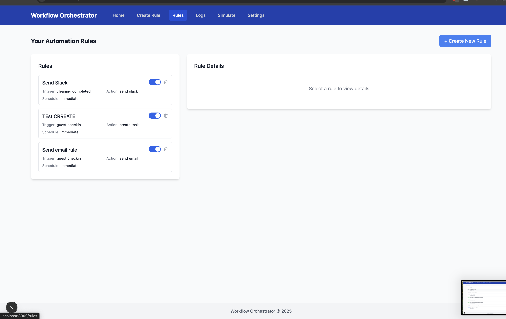
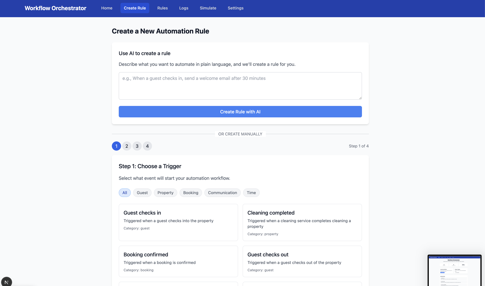
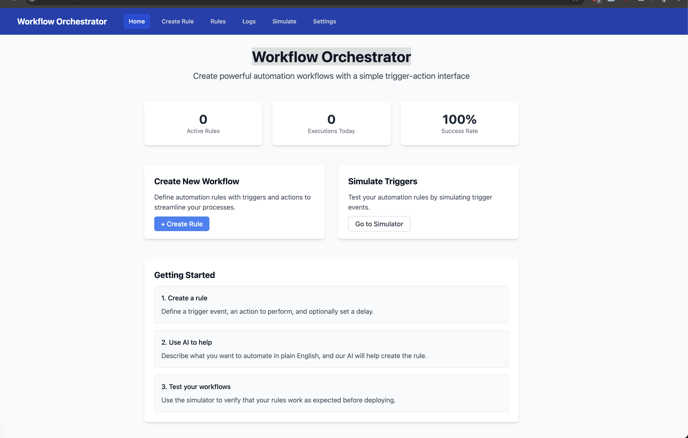
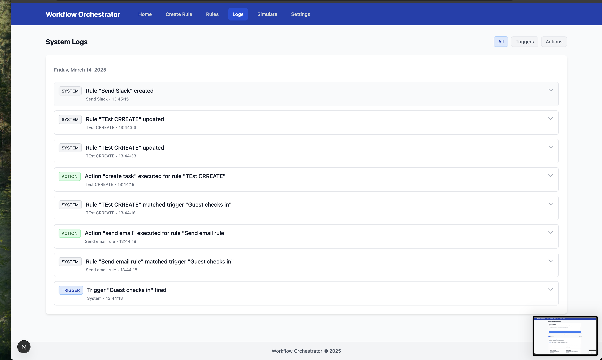

# 🚀 Workflow Orchestrator

A lightweight, extensible workflow orchestration tool built with **Next.js**, **Tailwind CSS**, and **React Flow**.

> **Live Demo**: [https://suiteop.tech](https://suiteop.tech/)

---

## ⚠️ Notice

> **Only the MVP is complete!** While the tool includes core functionality and several enhancements, additional features — especially around workflow execution — are needed to make it more robust. Planning to continue development shortly — got about one hour left today.

---

## ✨ Features

- **Rule-Based Workflows** – Build automations using a simple trigger-action model
- **Visual Workflow Builder** – Interactive canvas for designing your workflows
- **AI-Assisted Creation** – Leverage OpenAI to generate rules from natural language
- **Scheduling** – Support for immediate and delayed action execution
- **Simulation Engine** – Test workflows by simulating trigger events
- **Comprehensive Logging** – Track all system activities with detailed logs
- **Responsive UI** – Clean and modern interface powered by Tailwind CSS

---

## 🧰 Tech Stack

| Layer        | Technology                                      |
|--------------|-------------------------------------------------|
| Frontend     | React, Next.js, Tailwind CSS, React Flow        |
| Backend      | Next.js API Routes, Supabase (PostgreSQL)       |
| AI Features  | OpenAI API for natural language processing      |
| Deployment   | DigitalOcean App Platform (recommended)         |

---

## 🚀 Getting Started

### Prerequisites

- Node.js 14+ and `pnpm`
- Supabase account (for database)
- OpenAI API Key (for AI features, optional)

### Installation

1. Clone the repository:
   ```bash
   git clone https://github.com/yourusername/workflow-orchestrator.git
   cd workflow-orchestrator
   ```

2. Install dependencies:
   ```bash
   pnpm install
   ```

3. Set environment variables:
   Create a `.env.local` file in the root directory:
   ```env
   NEXT_PUBLIC_SUPABASE_URL=your-supabase-url
   NEXT_PUBLIC_SUPABASE_ANON_KEY=your-supabase-anon-key
   OPENAI_API_KEY=your-openai-api-key  # optional, can be added via the UI
   ```

4. Set up the database:
   - Create a new project in Supabase
   - Run the `schema.sql` file using Supabase SQL editor

5. Start the development server:
   ```bash
   pnpm dev
   ```

6. Visit [http://localhost:3000](http://localhost:3000) in your browser.

---

## 🚀 Deployment

Deploy on **DigitalOcean App Platform** with ease. See [`deploy-digitalocean.md`](deploy-digitalocean.md) for detailed instructions.

---

## 🧪 Usage Overview

### Creating a Rule

1. Navigate to **Create Rule**
2. Select a trigger event
3. Choose an action to perform
4. Schedule it (immediate or delayed)
5. Review and save your rule

### AI-Assisted Rule Creation

1. Enter a description of the automation you want
2. OpenAI parses your input into a structured rule
3. Review, adjust, and save

### Simulate Triggers

1. Go to the **Simulate** page
2. Select trigger type + parameters
3. Run simulation to preview workflow behavior

---

## 🔮 Planned Enhancements

- Browser automation agents
- Complex conditions + filtering
- Multiple actions per rule
- Workflow templates
- User management
- Integration marketplace

---

## 📄 License

MIT

---

## 🙌 Acknowledgements

- [Next.js](https://nextjs.org/)
- [Tailwind CSS](https://tailwindcss.com/)
- [React Flow](https://reactflow.dev/)
- [Supabase](https://supabase.io/)
- [OpenAI](https://openai.com/)

---

## 📸 Example Screenshots






---
